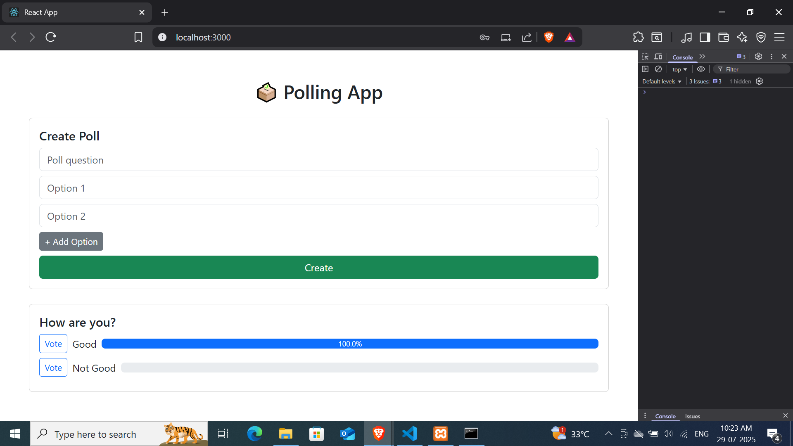

# 🗳️ Day 30: Polling App - #100DaysOfReact

A fully functional Polling App built using **React** (frontend), **Express.js** (backend), **MySQL via XAMPP** (database), and **Bootstrap** (UI framework), with complete user authentication and vote tracking.

## 🌟 Features

- 🔐 User Registration & Login (with password encryption)
- 📊 Vote on a poll anonymously or as a logged-in user
- 📍 Real-time vote percentages
- 🛠️ Admin capabilities to create/edit/delete polls
- 📌 MySQL integration using XAMPP
- 🎨 Enhanced UI with Bootstrap 5
- 🚀 Full backend + frontend connectivity

## 🧠 What I Learned

- Building REST APIs with Express and MySQL
- Connecting frontend with backend APIs
- Creating responsive layouts using Bootstrap
- Implementing authentication in MERN-like stacks
- Handling state using React hooks and context

## 🛠️ Tech Stack

| Frontend  | Backend   | Database | Auth     | UI        |
|-----------|-----------|----------|----------|-----------|
| React     | ExpressJS | MySQL    | JWT + Bcrypt | Bootstrap 5 |

## 🖼️ Screenshot

## 🔗 Live Demo:

🌍 **Live App**: [View Polling App Here](https://your-live-link.com)  

📁 **GitHub Repo**: [View Code on GitHub](https://github.com/Gauravg2630/React-polling-app)

---

## 📦 How to Run Locally

1. Start XAMPP
- Start **Apache** and **MySQL**
- Import `polling_db.sql` into **phpMyAdmin**

2. Setup Backend
cd backend
npm install
node index.js

3. Setup Frontend:
cd frontend
npm install
npm start
📌 Update your .env files in both frontend and backend as needed.

📬 Feedback & Suggestions
Pull requests and feedback are welcome. This is part of my #100DaysOfReact challenge. Let’s connect and grow together 🚀